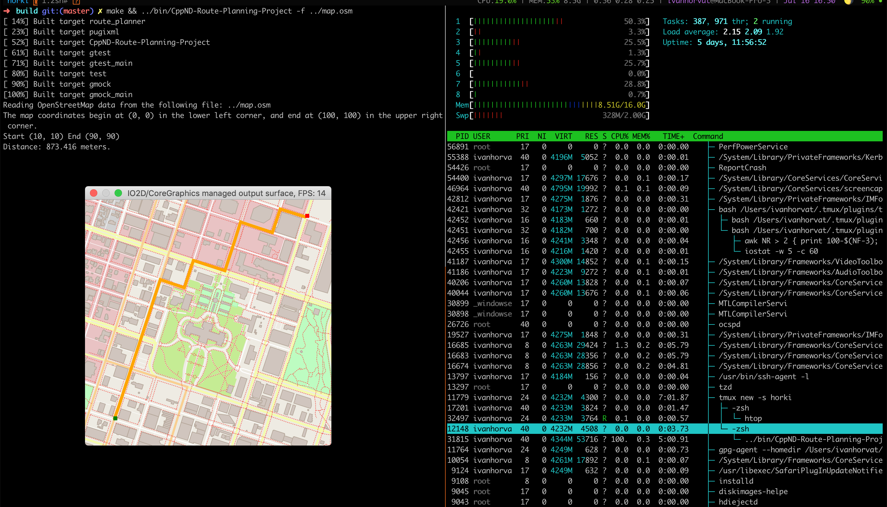

# Route Planning Project

This is the starter code for the Route Planning project. Instructions for each exercise can be found in the `instructions` directory, and unit tests for some exercises in the `test` directory.

## Cloning, EDIT

~~When cloning this project, be sure to use the `--recurse-submodules` flag. Using HTTPS:~~
We use Conan package manager, instead of git submodules.

```shell script
git clone git@github.com:Horki/CppND-Route-Planning-Project.git
```

## Compiling and Running

### Install IO2D
[IO2D](https://github.com/cpp-io2d/P0267_RefImpl/) package is still missing in Conan repo, so we need to build and *install* it [manually](https://github.com/cpp-io2d/P0267_RefImpl/blob/master/BUILDING.md).

### Compiling
To compile the project, first, create a `build` directory and change to that directory:
```shell script
mkdir build && cd build
```

From within the `build` directory, first install dependencies with `conan` then run `cmake` and `make` as follows:
```shell script
conan install .. --build missing
cmake ..
make
```
### Running
The executables will be placed in the `bin` directory. From within `build`, you can run the project as follows:
```shell script
../bin/<name-of-parent-directory> -f ../data/map.osm
```

## Testing

For exercises that have unit tests, the project must be built with the approprate test cpp file. This can be done by passing a string with the `-DTESTING` flag in `cmake`. For example, from the build directory:
```
cmake -DTESTING="RouteModel" ..
make
```
Those commands will build the code with the tests for the "Fill Out Route Model" exercise. The tests can then be run from the `build` directory as follows:
```
../bin/test
```
Exercises with tests will specify which string to pass with `-DTESTING`, but a table is given below with the complete list for reference:

| Exercise Name               | `-DTESTING` String Value |
|-----------------------------|:------------------------:|
| Fill Out Route Model        |       "RouteModel"       |
| Fill Out Node Class         |       "RMNodeClass"      |
| Create RouteModel Nodes     |        "RMSNodes"        |
| Write the Distance Function |        "NodeDist"        |
| Create Road to Node Hashmap |       "NodeToRoad"       |
| Write FindNeighbors         |      "FindNeighbors"     |
| Find the Closest Node       |       "FindClosest"      |
| Write the A\* Search Stub   |        "AStarStub"       |
| Finish A\* Search           |       "AStarSearch"      |


# My solution

Compile

```bash
make build
```

Run (ex: from build)

```bash
build $ ../bin/CppND-Route-Planning-Project -f ../data/map.osm
```

Tasks

Exercise Name | Status
--- | ---
Add User Input | Done
Complete A\* Star Search | Done
Create RouteModel Nodes | Done
Fill RoutePlanner constructor | Done
Fill out Node class | Done
Fill out RouteModel class | Done
Fill out RoutePlanner class | Done
Write A\* Star Search stub | Done
Write AddNeighbors | Done
Write CalculateHValue | Done
Write ConstructFinalPath | Done
Write CreateNodeToRoadHashmap | Done
Write FindClosestNode | Done
Write FindNeighbor | Done
Write FindNeighbors | Done
Write NextNode | Done
Write distance function | Done


<!--

Tests

| Exercise Name               | `-DTESTING` String Value | Status |
|-----------------------------|:------------------------:|:-------|
| Fill Out Route Model        |       "RouteModel"       | FAILED |
| Fill Out Node Class         |       "RMNodeClass"      | FAILED |
| Create RouteModel Nodes     |        "RMSNodes"        | PASSED |
| Write the Distance Function |        "NodeDist"        | PASSED |
| Create Road to Node Hashmap |       "NodeToRoad"       | FAILED |
| Write FindNeighbors         |      "FindNeighbors"     | FAILED |
| Find the Closest Node       |       "FindClosest"      | FAILED |
| Write the A\* Search Stub   |        "AStarStub"       | FAILED |
| Finish A\* Search           |       "AStarSearch"      | FAILED |
-->


Running "Route Planning Project" start(10, 10), end(90, 90)


TODO

- [ ] Add IO2D package through Conan, when available
- [x] [GTest](https://github.com/google/googletest), through Conan
- [x] [pugiXML](https://pugixml.org/), through Conan